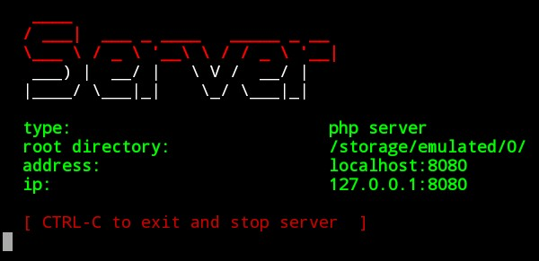

# server

this is simple script that you can start `php` , `python` , `node.js` , `mysql database` server.  
once you start server , for next time it won't ask you for _root directory_ and _port_ , it use your first time information.  
you can change this information in settings  

### capabilities
* php web server
* node.js web server
* python web server
* mysql database
* save root directory and port for next use
---

### installation
1.`git clone https://github.com/Mouod59/server.git`  
2.`cd server`  
3.`chmod +x server`  
4.`./server`  
**you can move `server` file to bin directory for easy use  
then you can run script with `server`**  
___
### tutorial
1.**root directory** : the directory that your codes have been there  
2.**port : look at this address `localhost:8080`** the number after ` : ` is port  
___

### Author
Mohammad Mohammadi  
follow me on [Instagram](https://instagram.com/sarbazg180)
  

